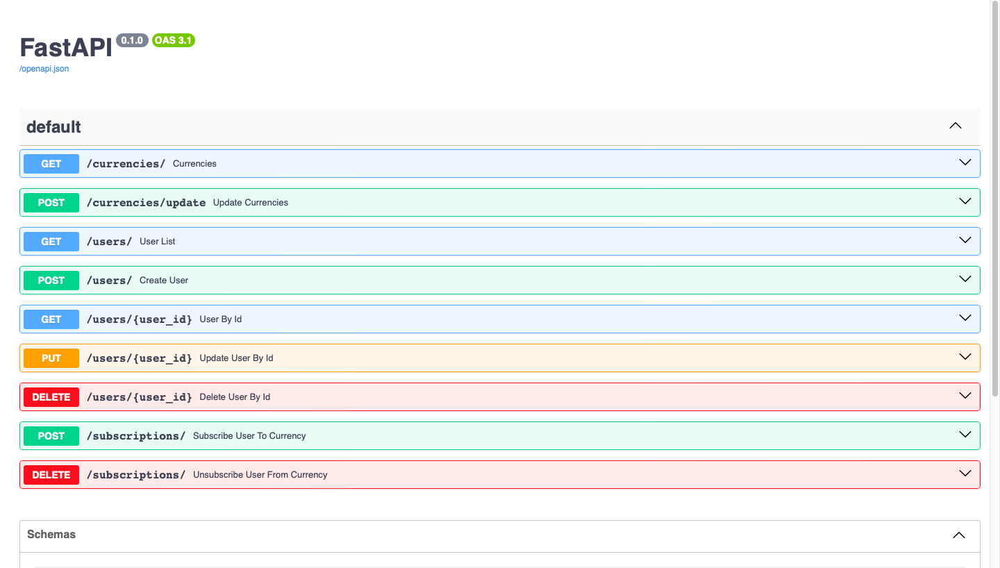

# Лабораторная работа 3. Разработка REST API для отслеживания курсов валют (FastAPI + SQLAlchemy)

## Цель работы
Разработать асинхронное веб-приложение (REST API) с использованием фреймворка FastAPI и библиотеки SQLAlchemy (в качестве ORM) для взаимодействия с базой данных SQLite. Приложение должно предоставлять функционал регистрации пользователей и подписки на отслеживание актуальных курсов валют, получаемых от Центрального банка РФ.

## Скриншоты



## Запуск
Для запуска выполните данную команду в терминале:
```shell
uvicorn main:app 
```
